# Corporate AI Dashboard

A real-time AI operations dashboard that connects to a multi-agent Corporate AI backend. Chat with your AI COO, watch agents collaborate in real time, and monitor all inter-agent communication by channel.

```
[Browser Dashboard]  ←→  [Relay :3001]  ←→  [Corporate AI :8000]  ←→  [Ollama / LLM]
```

## Screenshots

<details>
<summary>Click to expand</summary>

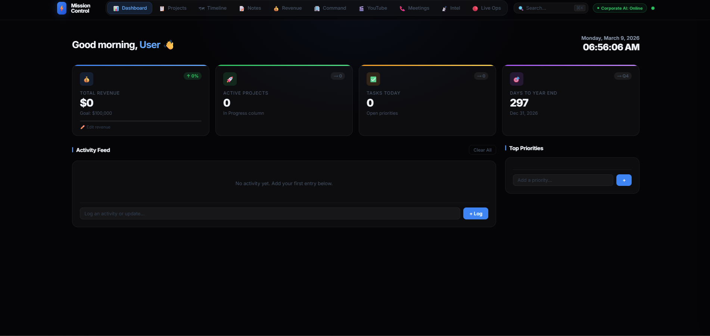
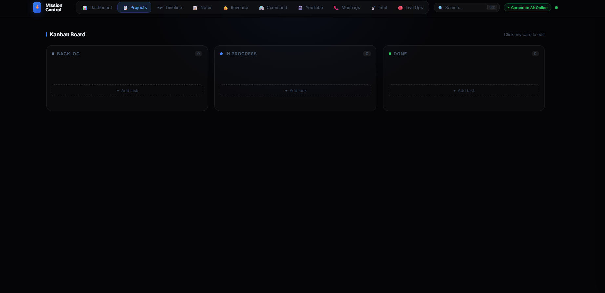
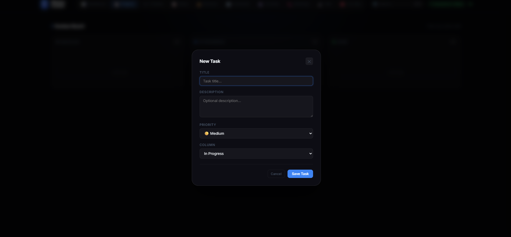
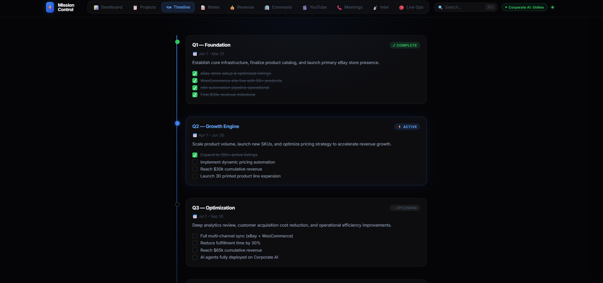
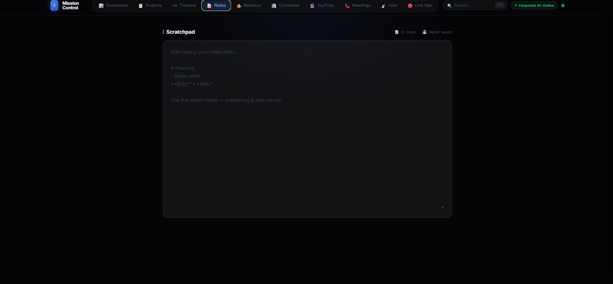
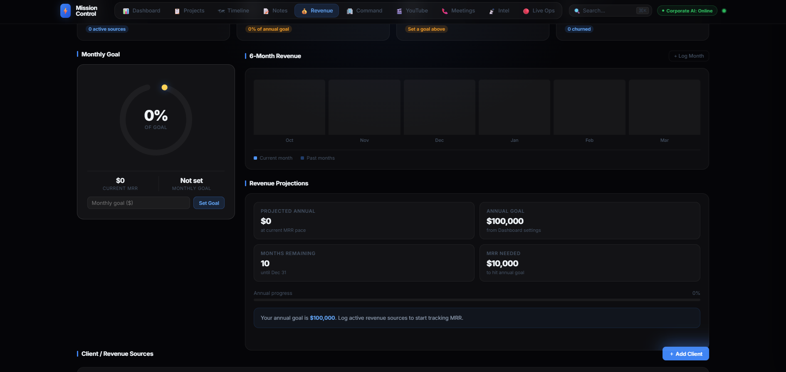
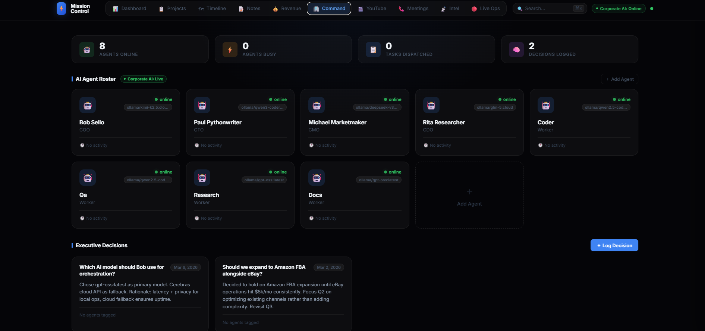
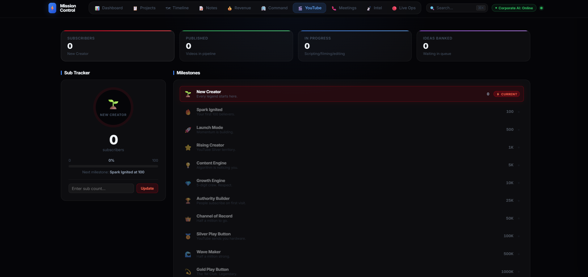
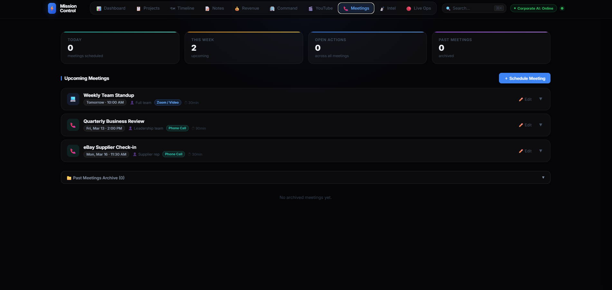
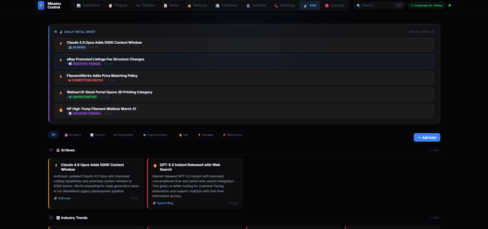
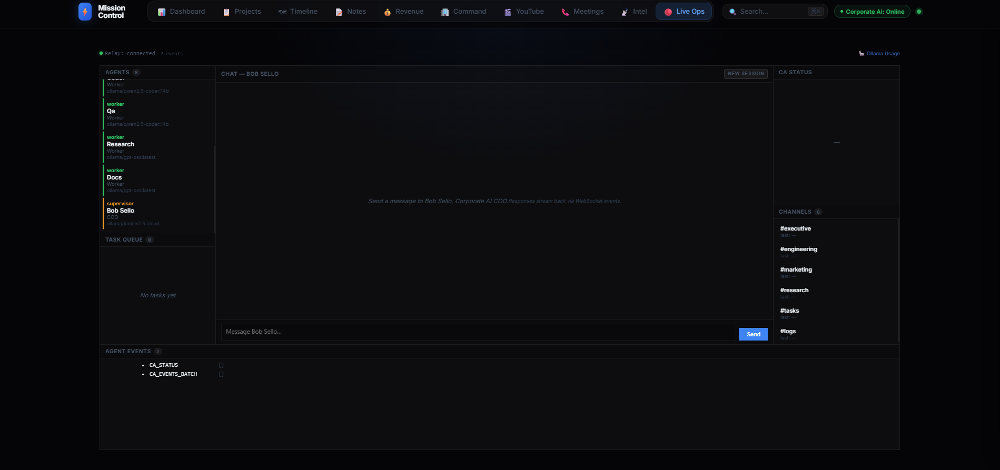
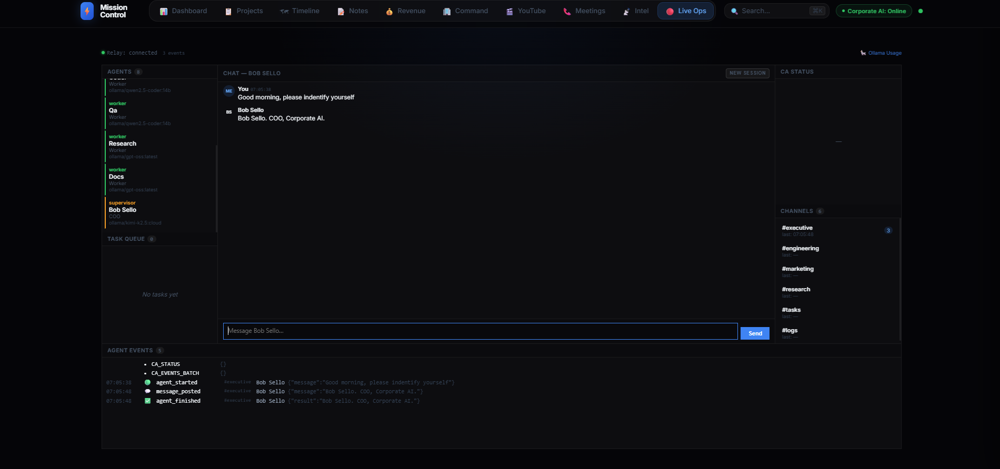

</details>

---

## Architecture

| Component | Directory | Port | Purpose |
|-----------|-----------|------|---------|
| Dashboard | `dashboard/` | 3000 | Single-page frontend (HTML/CSS/JS) |
| Relay | `relay/` | 3001 | Node.js bridge — proxies REST + WebSocket |
| Corporate AI | `./` (repo root) | 8000 | Python FastAPI — multi-agent orchestrator |

**Agent hierarchy:** Bob Sello (COO/Supervisor) → 3 Executives (CTO, CMO, CDO) → 4 Workers (coder, QA, research, docs)

---

## Directory Structure

`corporate-ai` is the repository root. The dashboard and relay live inside it:

```
corporate-ai/
├── agents/              ← Supervisor + Executive agent logic
├── api/                 ← FastAPI routes
├── config/
│   ├── agents.yaml      ← Agent names, roles, heartbeat config
│   ├── models.yaml      ← LLM provider & model per agent
│   └── prompts/         ← Editable markdown prompt files per agent
├── dashboard/           ← Frontend SPA
│   └── index.html
├── logs/                ← Created on first start; stdout/stderr per service
├── memory/
│   ├── conversations.json        ← Short-term: active session turns
│   ├── daily/                    ← Mid-term: YYYY-MM-DD-supervisor.md logs
│   └── (ChromaDB vector store)   ← Long-term: semantic search index
├── orchestrator/        ← Event bus, task queue, agent manager
├── relay/               ← Node.js relay server
│   ├── server.js
│   └── package.json
├── tools/               ← Filesystem, shell, git, web tools for workers
├── workers/             ← Worker agents (coder, QA, research, docs)
├── workspace/           ← Sandboxed agent file workspace (git-initialised)
├── main.py              ← FastAPI backend entry point
├── requirements.txt
├── server_start.bat     ← Start all services (Windows)
├── server_stop.bat      ← Stop all services (Windows)
├── server_start.sh      ← Start all services (Linux/macOS)
├── server_stop.sh       ← Stop all services (Linux/macOS)
└── README.md
```

---

## Prerequisites

| Tool | Version | Notes |
|------|---------|-------|
| Python | 3.11+ | Backend |
| pip | latest | `python -m pip install --upgrade pip` |
| Node.js | 18+ | Relay + `npx serve` for dashboard |
| npm | bundled with Node | |
| Git | any | Agent workspace is git-initialised |
| Ollama | latest | Only needed for local models — [ollama.com](https://ollama.com) |

---

## Installation

### 1. Clone / Download

```bash
git clone https://github.com/brian-ebarb/corporate-ai.git
cd corporate-ai
```

### 2. Install Backend Dependencies

```bash
pip install -r requirements.txt
```

### 3. Install Relay Dependencies

```bash
cd relay && npm install && cd ..
```

> `server_start` handles this automatically on first run if you skip this step.

### 4. Configure LLM Models

Edit `config/models.yaml` to choose your LLM provider.

**Option A — Ollama (default, local, free)**

Pull models first:
```bash
ollama pull deepseek-r1:latest
ollama pull qwen2.5-coder:latest
ollama pull llama3.1:latest
```

Make sure `ollama serve` is running before starting the backend.

**Option B — Anthropic Claude**

```yaml
supervisor:
  provider: anthropic
  model: claude-sonnet-4-6

api_keys:
  anthropic: "sk-ant-..."   # or set ANTHROPIC_API_KEY env var
```

**Option C — OpenAI**

```yaml
supervisor:
  provider: openai
  model: gpt-4o

api_keys:
  openai: "sk-..."   # or set OPENAI_API_KEY env var
```

**Option D — OpenRouter** (access any model)

```yaml
supervisor:
  provider: openrouter
  model: deepseek/deepseek-r1

api_keys:
  openrouter: "sk-or-..."   # or set OPENROUTER_API_KEY env var
```

You can mix providers — assign a different provider per agent in `models.yaml`.

### 5. Configure Agents (Optional)

Edit `config/agents.yaml` to rename agents, adjust roles, or set your name for the dashboard greeting:

```yaml
user:
  name: Your Name         # shown in the dashboard greeting

supervisor:
  name: Bob Sello
  role: COO

executives:
  - name: Paul Pythonwriter
    role: CTO
    department: engineering

  - name: Michael Marketmaker
    role: CMO
    department: marketing

  - name: Rita Researcher
    role: CDO
    department: research
```

### 6. Customise Agent Prompts

All agent prompts live in `config/prompts/` as plain markdown files. Edit them freely — changes take effect on the next backend restart.

| File | Purpose |
|------|---------|
| `USER.md` | **Start here.** Describes who the user is, the business context, tech stack, preferences, and hard constraints. Injected into every agent. |
| `COMPANY.md` | Org chart and communication rules shared by all agents. |
| `SUPERVISOR.md` | Bob's identity, decision rules, routing logic, and response format. |
| `EXECUTIVE.md` | Shared behavior guide for all executives (task breakdown, delegation, synthesis). |
| `EXECUTIVE1.md` | Individual identity for the **first** executive in `agents.yaml` (CTO by default). |
| `EXECUTIVE2.md` | Individual identity for the **second** executive (CMO by default). |
| `EXECUTIVE3.md` | Individual identity for the **third** executive (CDO by default). |
| `WORKER_CODER.md` | Coder worker — tools, workflow, code standards. |
| `WORKER_QA.md` | QA worker — testing approach and reporting format. |
| `WORKER_RESEARCH.md` | Research worker — web search tools and output standards. |
| `WORKER_DOCS.md` | Docs worker — documentation and formatting rules. |

**`USER.md` is the most impactful file to fill in.** The more context agents have about your business, tech stack, and preferences, the better their decisions and output.

`EXECUTIVE{n}.md` files correspond to executives by **position** in `agents.yaml`, not by name — so renaming an executive doesn't break anything. If you add a fourth executive, create `EXECUTIVE4.md`. Files that don't exist are silently skipped.

---

## Running

### Windows

**Start:**
```
server_start.bat
```

**Stop:**
```
server_stop.bat
```

On startup you will be prompted to set the port for each service. Press **Enter** to accept the defaults:

```
  Configure ports (press Enter to accept defaults):

    Backend   port [8000]:
    Relay     port [3001]:
    Dashboard port [3000]:
```

All three services start as background processes with output redirected to `logs/`. PIDs are saved to `.pids` so `server_stop` can kill them reliably (including child processes). You will not see console windows — check `logs/backend.log`, `logs/relay.log`, and `logs/dashboard.log` if something isn't working.

> Requires PowerShell (included with Windows 10/11). Scripts run with `-ExecutionPolicy Bypass` so no policy changes are needed.

### Linux / macOS

```bash
chmod +x server_start.sh server_stop.sh

./server_start.sh   # prompts for ports, then starts all services in background
./server_stop.sh    # stop all services
```

Same port prompt and PID-file approach as Windows.

### Manual Start (any OS)

Open three terminals:

**Terminal 1 — Backend**
```bash
python main.py
```

**Terminal 2 — Relay**
```bash
cd relay && node server.js
```

**Terminal 3 — Dashboard**
```bash
cd dashboard && npx serve . -p 3000
```

Then open **http://localhost:3000** in your browser.

---

## Usage

### Live Ops Tab

The primary real-time view.

- **Left panel — Agents**: Click any agent to see their recent activity in the centre. Click **Bob Sello** to return to the chat.
- **Centre panel — Chat / Activity**: Chat with Bob Sello (COO). Switches to an agent event feed when you select a non-Bob agent.
- **Right panel — Active Now / Status / Channels**: "Active Now" shows which agent is currently running, their current step, and time elapsed — updated in real time. Click any channel (#executive, #engineering, etc.) to see all agent-to-agent messages on that channel.
- **Bottom panel — Agent Events**: Full event log from all agents.

### Sending a Message

Type in the chat input and press **Enter** or click **Send**. Bob routes the request to the appropriate executive and workers. The full delegation chain is visible in the event log.

### New Session

Click **New Session** (top-right of the chat panel) to start a fresh conversation with Bob. This clears the short-term conversation history (`conversations.json`) so the next message begins with no prior turns in context.

The daily log and long-term vector memory are **not** cleared — Bob retains awareness of what happened today and in past sessions through those layers. New Session is purely about resetting the active dialogue, not wiping memory entirely.

### Slash Commands

Type these directly in the chat input to get system information without involving the LLM:

| Command | What it does |
|---------|-------------|
| `/status` | Reports the active model and provider. For Ollama: shows which models are loaded in memory, parameter size, quantization, and RAM/VRAM usage. For cloud providers (Anthropic, OpenAI, OpenRouter): shows the configured model, masked API key, and a live connectivity check against the provider's API. |
| `/reset-memory` | **Destructive.** Clears all three memory layers: conversation history (`conversations.json`), daily logs (`memory/daily/`), and the ChromaDB vector store. Use this when agents seem confused about previously completed work, are declaring tasks done without doing anything, or when you want to start completely fresh. There is no undo — run `server_stop`, then `/reset-memory`, then restart. |

> **When to use `/reset-memory`:** If an executive immediately declares a task "done" without dispatching any workers, it's almost always because the vector memory from a previous session convinced it the work was already complete. Run `/reset-memory` to clear that false context.

### Timeline Tab

A visual roadmap editor. Click **Edit** to enter edit mode — you can rename phases, change dates, update the status (Done / Active / Upcoming), edit descriptions, check off milestones, and add or remove both milestones and phases. Click **Save** when done. Changes persist to `localStorage` across page refreshes.

### Command Center Tab

Browse the full AI agent roster. Click any agent card to view info and recent activity. The Chat tab on Bob Sello's card opens a direct conversation. Other agents are view-only — all user communication routes through the COO.

---

## Memory & Context Management

The supervisor uses a three-layer memory model:

| Layer | Storage | What it holds | Survives |
|-------|---------|---------------|----------|
| Short-term | `memory/conversations.json` | Active session message turns (what the LLM sees right now) | Restarts |
| **Mid-term** | `memory/daily/YYYY-MM-DD-supervisor.md` | Full day's activity log — every request, decision, and outcome | Compaction, restarts, new sessions |
| Long-term | `memory/` (ChromaDB) | Semantic vector store for all-time recall by similarity | Everything |

**How they work together:**

1. Each time Bob handles a message, he reads the last 24 hours of the daily log plus any semantically relevant past context, giving him genuine "what happened today" awareness even after context compaction.
2. After responding, he writes a timestamped entry to today's markdown file (`memory/daily/YYYY-MM-DD-supervisor.md`) capturing the request, action taken, and outcome.
3. The short-term `conversations.json` holds the raw turn-by-turn message history for the active session. When the context window fills, it is compacted (old turns summarized) but the daily log is never compacted — it keeps the full record.
4. On each interaction, recent entries are also embedded and stored in ChromaDB so specific facts, decisions, and file paths remain searchable far into the future.

The daily log files are plain markdown — you can read, edit, or delete them directly.

**Context window and compaction** are configurable per agent in `config/models.yaml`:

```yaml
context:
  supervisor:
    context_length: 256000
    compaction_threshold: 0.5   # compact when 50% full
  executives:
    engineering:
      context_length: 256000
      compaction_threshold: 0.5
```

When a context window approaches its threshold, older messages are summarised automatically and replaced with a compact summary, preserving the most recent turns verbatim. The daily log is unaffected by compaction.

---

## Agent Workspace

All agent file operations are sandboxed to:

```
corporate-ai/workspace/
```

This directory is git-initialised. Agents can read, write, and commit files here using their built-in tools. Inspect it any time to see what the agents have produced.

---

## Logs

Service output is written to `logs/` when started via the start scripts:

| File | Service |
|------|---------|
| `logs/backend.log` / `backend.err` | Python FastAPI backend |
| `logs/relay.log` / `relay.err` | Node.js relay |
| `logs/dashboard.log` / `dashboard.err` | npx serve (dashboard) |

---

## Environment Variables

Override settings without editing config files.

| Variable | Default | Description |
|----------|---------|-------------|
| `ANTHROPIC_API_KEY` | — | Anthropic API key |
| `OPENAI_API_KEY` | — | OpenAI API key |
| `OPENROUTER_API_KEY` | — | OpenRouter API key |
| `OLLAMA_HOST` | `http://localhost:11434` | Ollama base URL — change if Ollama runs on a different host or port |
| `PORT` | `8000` | Backend listen port (set automatically by start script from your input) |
| `CA_HOST` | `localhost` | Relay: hostname of the backend |
| `CA_PORT` | `8000` | Relay: port of the backend (set automatically by start script) |
| `RELAY_PORT` | `3001` | Relay listen port (set automatically by start script) |

---

## Troubleshooting

| Problem | Fix |
|---------|-----|
| Badge shows "CA OFFLINE" | Start the backend and relay. The relay retries every 5 seconds automatically. |
| Relay: `ECONNREFUSED` | Backend not running yet — wait or check `logs/backend.log` |
| LiteLLM: model not found | Pull the model: `ollama pull <model-name>` |
| LiteLLM: auth error | Add API key to `config/models.yaml` or set the env var |
| Chat stuck on "Working…" | Check `logs/backend.log` — usually an LLM error. Also try **New Session** to clear stuck state. |
| Executive declares done immediately, nothing built | Vector memory from a previous session is causing false confidence. Run `/reset-memory` in the chat input and retry the task. |
| Executive returns "Could not determine next action" | The LLM returned malformed JSON. The system will synthesize from whatever work was completed. If nothing was done, try `/reset-memory` and resend. |
| `/status` shows "unreachable" | Ollama isn't running, or is on a non-default port — set `OLLAMA_HOST=http://host:port` |
| `/status` shows no models loaded | A model hasn't been used yet this session — send a message first to load it |
| `chromadb` import error | `pip install chromadb` |
| Port already in use | Check `.pids` for a leftover process; run `server_stop` first |
| Port 8000 in use after stop | `taskkill /F /IM python.exe` (Windows) or `pkill python` (Linux) |
| PowerShell blocked on Windows | Run `server_start.bat` — it already includes `-ExecutionPolicy Bypass` |
| `server_start.sh`: Permission denied | `chmod +x server_start.sh server_stop.sh` |

---

## Tech Stack

- **Frontend**: Vanilla HTML/CSS/JS (single file, no build step)
- **Relay**: Node.js, Express, `ws`
- **Backend**: Python, FastAPI, LiteLLM, ChromaDB, asyncio
- **LLMs**: Ollama (local) or any provider supported by LiteLLM
